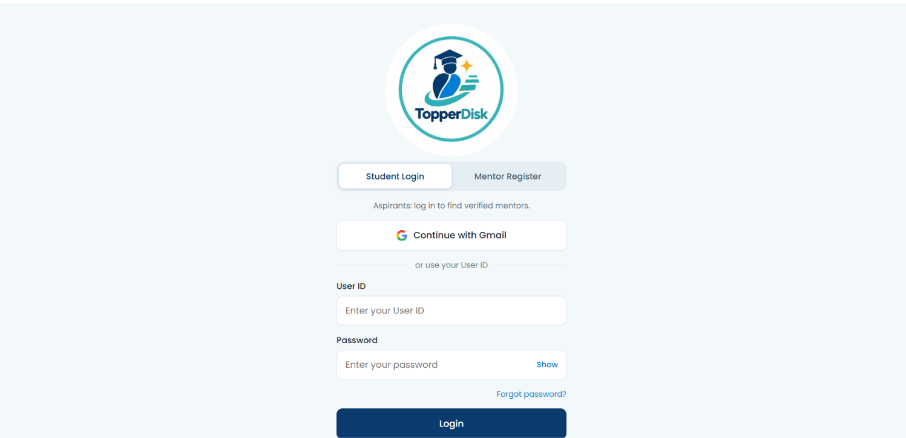
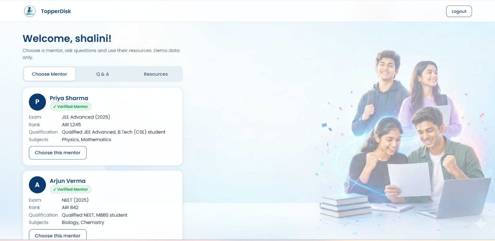
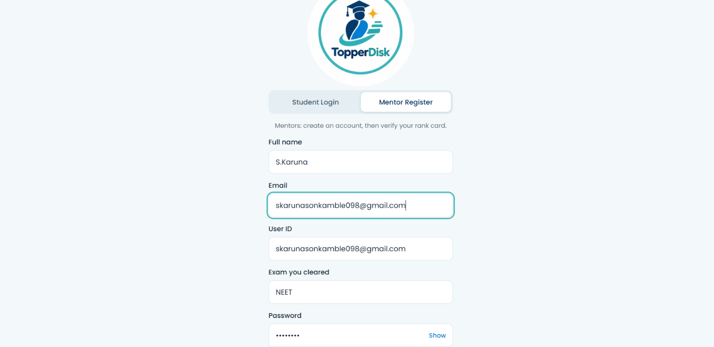
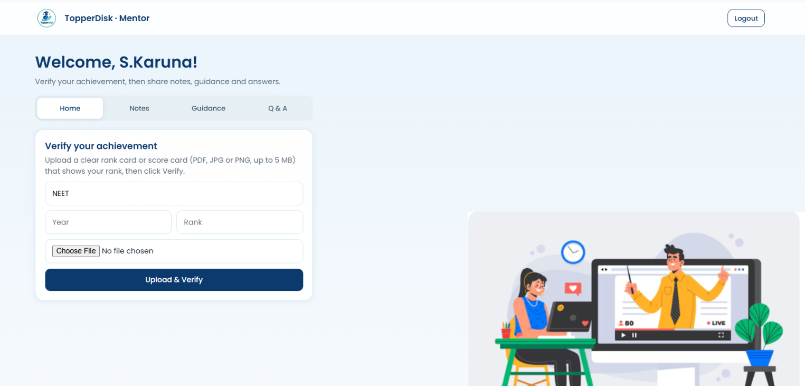

# 🎓 TopperDisk

### Connect with Verified Toppers. Learn from Their Experience.

TopperDisk is a mentorship platform that connects aspirants with verified toppers who can share their knowledge, strategies, notes, and experiences to help aspirants achieve their academic goals.
## 🚨 Problem Statement

### Inclusive Technology

Many students and aspirants, especially those who do not have access to personal guidance or experienced mentors, struggle to find reliable academic support.

Although toppers have valuable knowledge, preparation strategies, notes, and personal experiences, there is no dedicated platform that provides a structured way for aspirants to connect with genuinely qualified and experienced mentors.

This creates a gap between **students seeking guidance** and **toppers willing to share their experience**.

### Key Challenges

- ❌ Limited access to experienced and qualified mentors
- ❌ Difficulty identifying trustworthy academic guidance
- ❌ Lack of a structured platform connecting toppers and aspirants
- ❌ Valuable preparation strategies and experiences remain scattered
- ❌ Students may not have equal access to personalized guidance

**TopperDisk addresses this gap by creating an accessible mentorship platform that connects aspirants with verified toppers.**

## 💡 Our Solution

### TopperDisk

TopperDisk is a mentorship platform designed to connect **aspirants with verified toppers and experienced mentors**.

Mentors can create their profiles and submit their rank-card or achievement proof for verification. Once verified, they can share their preparation strategies, notes, study plans, and experiences with aspirants.

Aspirants can explore verified mentors, view their qualifications and experiences, ask questions, and receive guidance based on their goals.

### How TopperDisk Solves the Problem

- ✅ Connects aspirants with verified toppers
- ✅ Provides a structured mentor verification process
- ✅ Makes mentor qualifications visible to aspirants
- ✅ Enables knowledge sharing through notes, strategies, and experiences
- ✅ Provides a platform for direct Q&A and mentorship
- ✅ Makes quality academic guidance more accessible

  ## ✨ Key Features

### 👨‍🎓 For Aspirants

- 🔍 **Find Verified Mentors** – Explore mentors based on their qualifications and achievements.
- 👤 **Mentor Profiles** – View a mentor's rank, qualification, experience, and areas of expertise.
- ❓ **Q&A** – Ask questions and get guidance from experienced mentors.
- 📚 **Learning Resources** – Access notes, strategies, study plans, and useful experiences shared by mentors.

### 🏆 For Mentors

- 📝 **Mentor Registration** – Create a mentor profile and provide relevant details.
- 📄 **Rank Card Upload** – Submit rank-card or achievement proof for verification.
- 🔐 **Qualification Verification** – Establish trust by verifying mentor achievements.
- 💡 **Knowledge Sharing** – Share preparation strategies, notes, formulas, and experiences.
- 🤝 **Mentorship** – Guide aspirants based on your own preparation journey.

### 🔎 Trust & Accessibility

- ✅ **Verified Mentor Profiles**
- 🔒 **Structured Verification Process**
- 🌐 **Accessible Online Platform**
- 🎯 **Direct Connection Between Aspirants and Mentors**

  ## 🔄 How It Works

TopperDisk provides separate workflows for **Aspirants** and **Mentors**.

### 👨‍🎓 Aspirant Flow

```text
Aspirant
   ↓
Create Account / Login
   ↓
Explore Verified Mentors
   ↓
View Mentor Profile & Qualifications
   ↓
Ask Questions / Explore Resources
   ↓
Connect with Mentor
   ↓
Receive Guidance

### Mentor Flow

Mentor
   ↓
Create Account / Login
   ↓
Complete Mentor Profile
   ↓
Upload Rank Card / Achievement Proof
   ↓
Verification Process
   ↓
Verified Mentor Profile
   ↓
Share Notes, Strategies & Experiences
   ↓
Guide Aspirants

### Verification flow

Rank Card / Achievement Proof
              ↓
       Verification
              ↓
      Verification Result
         ↙          ↘
    Verified       Not Verified
       ↓
Mentor Profile
       ↓
Visible to Aspirants
```

## 🏗️ System Architecture

TopperDisk follows a simple user-centered architecture connecting aspirants, mentors, verification, and learning resources.

```text
                    ┌─────────────────────┐
                    │      TopperDisk     │
                    │   Web Application   │
                    └──────────┬──────────┘
                               │
                 ┌─────────────┴─────────────┐
                 │                           │
          ┌──────▼──────┐             ┌──────▼──────┐
          │  Aspirant   │             │   Mentor    │
          └──────┬──────┘             └──────┬──────┘
                 │                           │
                 │                     Rank Card /
                 │                   Achievement Proof
                 │                           │
                 │                    ┌──────▼──────┐
                 │                    │ Verification│
                 │                    │   Process   │
                 │                    └──────┬──────┘
                 │                           │
                 │                    ┌──────▼──────┐
                 │                    │   Verified  │
                 │                    │    Mentor   │
                 │                    └──────┬──────┘
                 │                           │
                 └──────────┬────────────────┘
                            │
                     ┌──────▼──────┐
                     │   Mentor    │
                     │  Guidance   │
                     └──────┬──────┘
                            │
              ┌─────────────┼─────────────┐
              │             │             │
          ┌───▼───┐     ┌───▼───┐     ┌───▼───┐
          │  Q&A  │     │ Notes │     │Strategy│
          └───────┘     └───────┘     └────────┘
```
## 🛠️ Technology Stack

### Frontend
- **HTML5** – Structure of the web pages
- **CSS3** – Styling, layout, and responsive design
- **JavaScript** – Page interactions and prototype functionality

### Development & Deployment
- **GitHub** – Source code management and project repository
- **GitHub Pages** – Hosting and deployment of the prototype

### Planned Technology
- **AI-based Rank Card Verification** – Planned for automated verification of uploaded achievement documents.
- **Backend & Database** – Planned for secure user accounts, mentor profiles, verification records, and communication.

## 💻 Prototype

### Student Login



### Student Dashboard



### Mentor Registration



### Mentor Dashboard



## 🚀 Innovation & Uniqueness

TopperDisk focuses on building **trust-based academic mentorship** by connecting aspirants with toppers whose achievements can be verified.

### What Makes TopperDisk Different?

- 🏆 **Verified Toppers as Mentors**  
  Mentors are expected to provide rank-card or achievement proof, helping aspirants identify genuinely qualified mentors.

- 🔐 **Trust Through Verification**  
  The platform is designed around mentor verification rather than relying only on self-declared profiles.

- 🤝 **Direct Aspirant–Mentor Connection**  
  Aspirants can interact with experienced toppers through Q&A and mentorship.

- 📚 **Experience-Based Learning**  
  Mentors can share preparation strategies, notes, formulas, study plans, and personal experiences.

- 🎯 **Personalized Guidance**  
  Aspirants can explore mentors based on their qualifications and areas of expertise.

- 🌐 **Accessible Educational Mentorship**  
  TopperDisk aims to make quality guidance more accessible to students who may not have direct access to experienced mentors.

## 🌍 Impact & Benefits

TopperDisk aims to make academic mentorship more accessible, trustworthy, and experience-driven.

### 👨‍🎓 Benefits for Aspirants

- 🎯 **Access to Experienced Mentors** – Connect with toppers who have already achieved their academic goals.
- 🏆 **Verified Mentor Information** – View mentor qualifications and achievement details.
- 📚 **Real Preparation Strategies** – Learn study methods, strategies, formulas, and experiences from mentors.
- ❓ **Direct Q&A** – Ask questions and receive guidance based on real experiences.
- 🤝 **Personalized Guidance** – Find mentors based on qualifications and areas of expertise.

### 🏆 Benefits for Mentors

- 🌟 **Share Knowledge** – Share preparation strategies, notes, and experiences.
- 🤝 **Guide Aspirants** – Help students through their own academic journey and experience.
- 📚 **Knowledge Sharing Platform** – Provide useful resources to students.
- 🏅 **Showcase Achievements** – Build a mentor profile based on verified qualifications.

### 🌐 Overall Impact

TopperDisk helps bridge the gap between **students seeking guidance** and **successful students willing to mentor**.

The platform aims to create a more **accessible, trustworthy, and experience-based academic mentorship ecosystem**.
